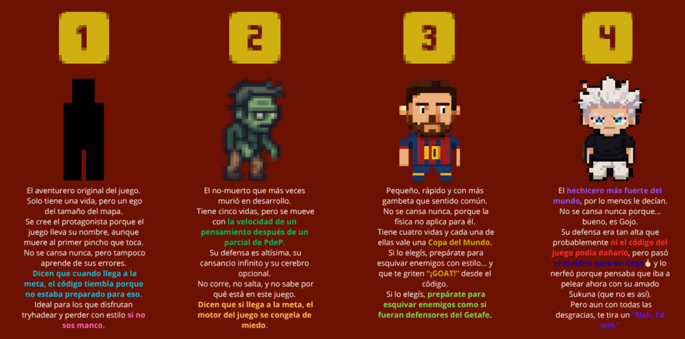
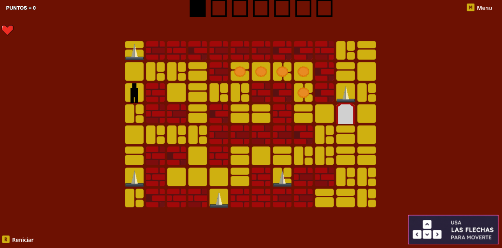

UTN - Facultad Regional Buenos Aires - Materia Paradigmas de Programación

    

## Equipo de desarrollo:
- [Dario Asurey](https://github.com/Dasurey)

- [Mayra Garcia](https://github.com/mayraegarcia)

- [Agustin Fernandez](https://github.com/Agustinf019)

## Introducción
El juego consta de pasar niveles evitando ser trolleado en el intento y ganando la mayor cantidad puntos obteniendo monedas.

## Capturas
### Pantalla de Inicio

### Pantalla de Personajes

### Juego Primer Nivel

## Reglas de Juego / Instrucciones
Para poder jugar:
1. Seleccionar un personaje con la letra P y luego un numero del 1 al 4.
2. Estar atento (te vas a morir varias veces jaja).
3. Los movimientos se realizan con la flechas del juego (Ojo, en algunos niveles el teclado se vuelve loco).
4. Para pasar completamente el juego se debe llegar al nivel 7 con la mayor cantidad de puntos

### Controles:
- Para seleccionar personaje P
- Para jugar J
- Para reiniciar R
- Para ir al menú M
- Para moverse: Flechas up, down, left y right

## Explicaciones teóricas y diagramas

### Conceptos teóricos aplicados
#### ***Polimorfismo***
Una forma de aplicar polimorfismo en nuestro juego fue mediante las colisiones o interacciones entre el personaje y los obstáculos. Implementamos el método `interactuarConPersonaje()` que tenía un comportamiento distinto dependiendo del obstáculo y de esta manera logramos que todos los obstáculos entiendan el mismo mensaje.

#### ***Herencia***
##### - Personajes
Tenemos cuatro jugadores modelados como objetos que heredan de la clases `JugadorCansado` o `JugadorNoCansado` y a su vez estas últimas heredan de la clase `Personaje`.

##### - Niveles
El juego cuenta con 7 niveles que heredan de la clase `NivelBase`.

##### - Objetos Moribles
Contamos con la clase `ObjetoMorible` y de ellan heredan las clases `MonedaFalsa`, `Pincho`, `PinchoInvisibleInstantaneo`, `PinchoInvisible` y `PinchoMovil`.